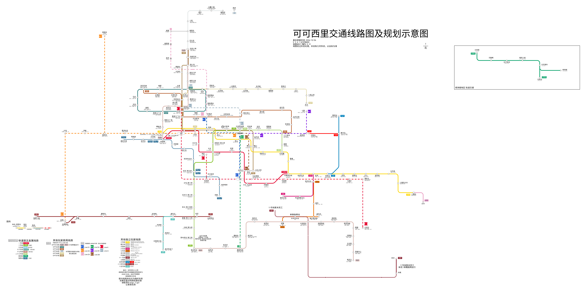

# CKOCC Metro map

The current metro network for the 可可西里 Minecraft server. The default branch contains the administrator-approved map.

| File | Purpose |
| --- | --- |
| [maps/network.json](maps/network.json) | Editable Rail Map Painter document, saved in document format version 80. |
| [maps/network.png](maps/network.png) | Original full-resolution rendered map. |
| [maps/manifest.json](maps/manifest.json) | File checksums, export metadata, and revision history links. |

## Current map



The initial files were supplied on 6 October 2026 as `可可西里26-10-6.json` and `可可西里26-10-6.png`. They were renamed without changing their contents. The image is 17,577 × 9,095 pixels (7,362,193 bytes); the JSON is 198,454 bytes. The document contains 395 graph nodes and 244 graph edges, including diagram elements; those counts are not station or metro-line counts.

Use [Rail Map Painter](https://railmapgen.org/?app=rmp) to open the JSON. This document's envelope matches the [editor's save format](https://github.com/railmapgen/rmp/blob/main/src/util/save.ts). The image was decoded and visually inspected during import. Reopening the JSON in the editor remains part of review; no automatic comparison between the document and its rendered image has been performed.

## Proposing updates

1. Start with the latest JSON on `main` and record its commit and map revision.
2. Edit in Rail Map Painter, then export the updated JSON and a matching PNG.
3. Replace `maps/network.json` and `maps/network.png` together on a new branch. Update the manifest with both file checksums and the revision you started from.
4. Open a pull request describing the changes. Add one `Closes #NUMBER` line per request fully addressed by the update.
5. An administrator checks the image, opens the JSON in the editor, reconciles concurrent changes, and merges the PR manually.

The planned website will perform the upload and PR steps for collaborators. Its user interface will support English (US), Simplified Chinese, and Traditional Chinese (Hong Kong). Until it is deployed, these steps are performed in the editor and GitHub.

Requests use the `metro-request` label, with `type:general` or `type:line-update`; line requests also use `operation:add` or `operation:update`. Selected requests should close when a PR merges, not when it is opened. Secrets and website account data never belong in this public repository.

## Manifest convention

`schema_version` is the manifest format version; `editor.document_version` is the original editor's format version. File SHA-256 hashes cover the original bytes. `map_revision` is `sha256:` followed by the SHA-256 digest of this UTF-8 sequence:

```text
<JSON file SHA-256 in lowercase hex>\n<PNG file SHA-256 in lowercase hex>\n
```

Here `\n` represents one LF byte, including the final LF. The first import has `base_commit_sha` and `base_map_revision` set to `null`; subsequent map updates record the actual base commit and map revision. Do not edit/reformat `network.json` just to improve its Git diff; preserve editor fields and formatting.

## Repository setup status

This is the initial map import. Automated PR validation, required status checks, and enforced branch protection will be configured as the website workflow is implemented. Until then, administrator review and freshness checks are manual. GitHub webhooks will be enabled once the backend endpoint is deployed.
